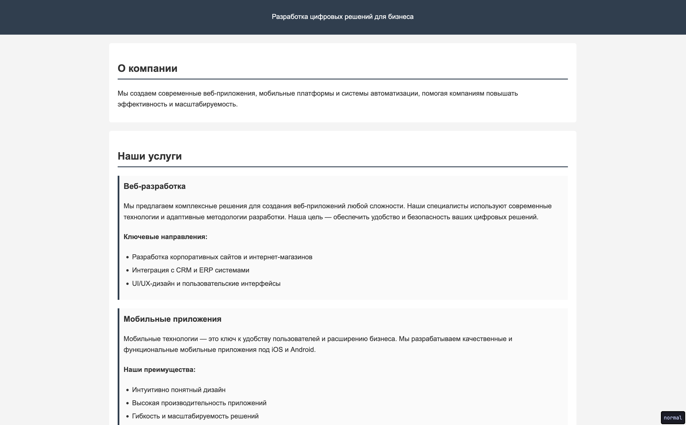

# Задание: Семантическая разметка 

## Задание

Вам дан текст, содержащий информацию со страницы сайта. Ваша задача — выделить в нём логические блоки, используя семантические HTML-теги.

Определите основные смысловые части текста (заголовки, параграфы, навигация, подвал и т. д.).

Используйте теги, которые указаны в [подсказках](#подсказки)

Оформите текст в виде корректного HTML-документа (название `index.html` в корне репозитория).

_В репозитории есть базовые стили, не забудьте подключить их_



Текст для разметки:

```
Разработка цифровых решений для бизнеса

О компании
Мы создаем современные веб-приложения, мобильные платформы и системы автоматизации, помогая компаниям повышать эффективность и масштабируемость.

Наши услуги

Веб-разработка
Мы предлагаем комплексные решения для создания веб-приложений любой сложности. Наши специалисты используют современные технологии и адаптивные методологии разработки. Наша цель — обеспечить удобство и безопасность ваших цифровых решений.
Ключевые направления:
Разработка корпоративных сайтов и интернет-магазинов
Интеграция с CRM и ERP системами
UI/UX-дизайн и пользовательские интерфейсы

Мобильные приложения
Мобильные технологии — это ключ к удобству пользователей и расширению бизнеса. Мы разрабатываем качественные и функциональные мобильные приложения под iOS и Android.
Наши преимущества:
Интуитивно понятный дизайн
Высокая производительность приложений
Гибкость и масштабируемость решений

Автоматизация бизнеса
Мы помогаем бизнесу автоматизировать ключевые процессы, экономя время и ресурсы.
Возможности автоматизации:
Разработка кастомных ERP-систем
Внедрение чат-ботов и голосовых помощников
Оптимизация бизнес-процессов

Почему выбирают нас
Мы следуем современным стандартам разработки, уделяем внимание деталям и предлагаем индивидуальный подход к каждому проекту.
10+ лет опыта в сфере IT
300+ успешных проектов
Передовые технологии и аналитический подход
Гибкость и адаптация под задачи клиента

Отзывы клиентов
"Команда быстро поняла наши задачи и предложила оптимальное решение. Итог — удобный и стильный сайт, который приносит новых клиентов." — Алексей Иванов, CEO TechCorp
"Мы искали подрядчика для мобильного приложения и не ошиблись с выбором. Профессиональный подход, быстрая обратная связь и отличное качество." — Екатерина Смирнова, директор маркетинга SoftSolutions

Наши кейсы
Разработка интернет-магазина для бренда одежды
Клиент: FashionTrend
Задача: Создать современный интернет-магазин с удобной системой управления товарами и интеграцией с платежными сервисами.
Решение:
Разработана адаптивная платформа с удобной навигацией
Интеграция с популярными платёжными системами
Автоматизированная система учета заказов и доставки
Результат: Увеличение онлайн-продаж на 40% за первые 3 месяца.

Разработка мобильного приложения для сети ресторанов
Клиент: FoodExpress
Задача: Разработать мобильное приложение для удобного заказа блюд и программы лояльности.
Решение:
Простое и удобное мобильное приложение с возможностью онлайн-заказа
Интеграция с CRM для персонализации предложений
Система бонусов и скидок для клиентов
Результат: Прирост числа заказов через приложение на 60%.

Контакты
Адрес: г. Москва, ул. Программная, д. 15, офис 304
Телефон: +7 (495) 123-45-67
Email: contact@digitaldev.ru
© 2025
```

## Подсказки

## 1. Семантические структурные теги

### `<header>` — шапка страницы или раздела

Используется для верхней части сайта: логотип, название, главное меню.

```html
<header>
    <h1>Мой сайт</h1>
    <p>Блог о программировании</p>
</header>
```

Может быть не только у всей страницы, но и у отдельного блока:

```html
<article>
    <header>
        <h2>Новая статья</h2>
    </header>
</article>
```

---

### `<nav>` — навигация

Внутри этого тега обычно размещают меню с ссылками.

```html
<nav>
    <ul>
        <li><a href="index.html">Главная</a></li>
        <li><a href="about.html">О нас</a></li>
        <li><a href="contacts.html">Контакты</a></li>
    </ul>
</nav>
```

Используется только для **основных навигационных блоков**, а не для любых ссылок.

---

### `<main>` — главное содержимое страницы

В этом теге размещается уникальный контент страницы.
На странице должен быть только **один** тег `<main>`.

```html
<main>
    <h2>Добро пожаловать!</h2>
    <p>Здесь находится основной текст страницы.</p>
</main>
```

---

### `<section>` — логический раздел

Используется для группировки связанного по смыслу контента.

```html
<section>
    <h2>Новости</h2>
    <p>Сегодня произошло много интересного...</p>
</section>
```

На странице может быть много секций.

---

### `<article>` — независимый контент

Подходит для материалов, которые могут существовать отдельно:

* статья,
* пост в блоге,
* новость,
* комментарий.

```html
<article>
    <h2>Как выучить HTML</h2>
    <p>HTML — это язык разметки...</p>
</article>
```

---

### `<aside>` — дополнительная информация

Обычно используется как боковая панель (sidebar), блок с рекламой, справкой и т.п.

```html
<aside>
    <h3>Полезные ссылки</h3>
    <ul>
        <li>Документация</li>
        <li>Учебники</li>
    </ul>
</aside>
```

Содержимое `<aside>` не является основным для страницы.

---

### `<footer>` — подвал

Нижняя часть страницы: авторские права, контакты, ссылки.

```html
<footer>
    <p>© 2025 Все права защищены</p>
</footer>
```

---

# 2. Теги для текста

### Заголовки `<h1>` – `<h6>`

Используются для названий и подзаголовков.

* `<h1>` — самый главный заголовок (обычно один на странице)
* `<h6>` — самый мелкий

Пример:

```html
<h1>Главный заголовок</h1>
<h2>Подзаголовок</h2>
<h3>Меньший подзаголовок</h3>
```

Важно соблюдать иерархию:
не перескакивать с h1 сразу на h5.

---

### `<p>` — параграф

Обычный абзац текста.

```html
<p>Это первый абзац текста.</p>
<p>А это второй абзац.</p>
```

Для любого обычного текста почти всегда используется именно `<p>`.

---

# 3. Списки

## Ненумерованный список: `<ul>` + `<li>`

Используется, когда порядок не важен.

```html
<ul>
    <li>Яблоки</li>
    <li>Груши</li>
    <li>Бананы</li>
</ul>
```

Выглядит как список с маркерами.

---

## Нумерованный список: `<ol>` + `<li>`

Когда важен порядок пунктов.

```html
<ol>
    <li>Включить компьютер</li>
    <li>Открыть браузер</li>
    <li>Зайти на сайт</li>
</ol>
```

---

## Пример

```html
<header>
    <h1>Мой блог</h1>
</header>

<nav>
    <ul>
        <li>Главная</li>
        <li>Статьи</li>
        <li>Контакты</li>
    </ul>
</nav>

<main>
    <section>
        <article>
            <h2>Первая статья</h2>
            <p>Текст статьи...</p>
        </article>
    </section>

    <aside>
        <p>Реклама или полезные ссылки</p>
    </aside>
</main>

<footer>
    <p>© Мой сайт</p>
</footer>
```

## Как запустить проект

1. Установите пакет для хоста HTML страниц

```bash
npm install -g live-server
```

2. Запустите сервер

```bash
live-server
```

# Как сдавать

- Создайте форк репозитория в вашей организации с названием-этого-репозитория-вашафамилия
- Используя ветку wip сделайте задание
- Зафиксируйте изменения в вашем репозитории
- Когда документ будет готов - создайте пул реквест из ветки wip (вашей) на ветку main (тоже вашу) и укажите меня (ktkv419) как reviewer

Не мержите сами коммит, это сделаю я после проверки задания
